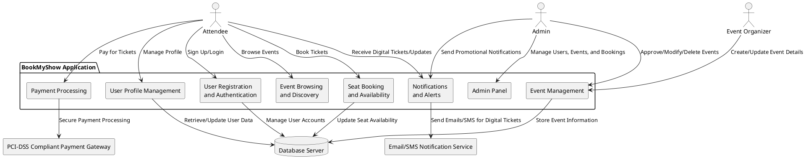
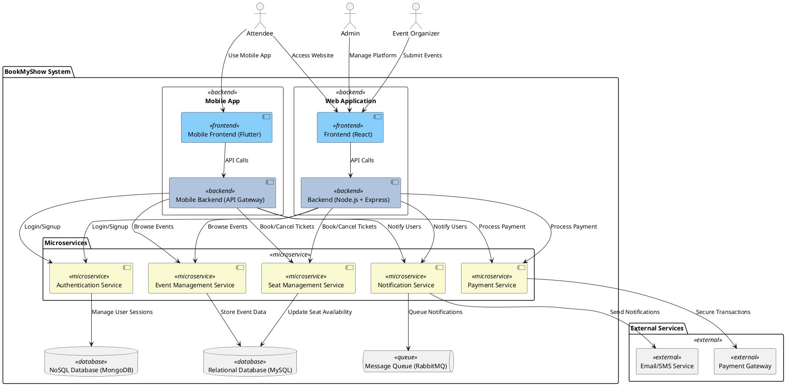
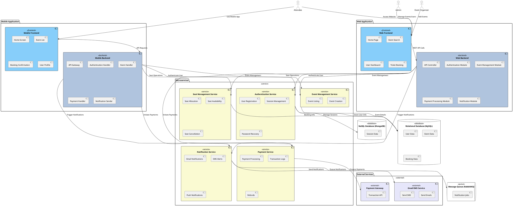
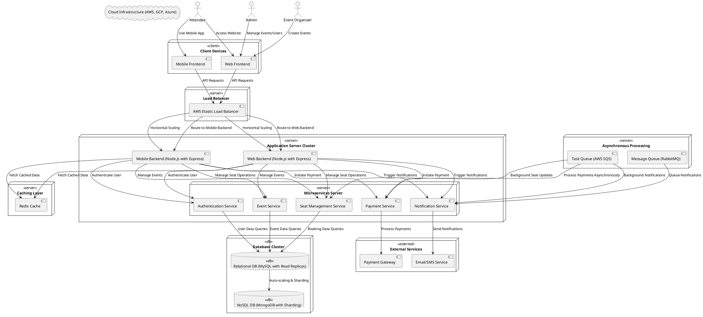

# Architecture Documentation

This document contains all the diagrams and their respective PlantUML code for the project.

---

## 1. System Context Diagram

### Diagram
  

### Code

---

## 2. Container Diagram

### Diagram
  

### Code

---

## 3. Component Diagram

### Diagram
  

### Code

---

## 4. Deployment Diagram

### Diagram
  

### Code

---

