# Software Design Description (SDD) for BookMyShow Clone

---

## 1. Introduction

### 1.1 Purpose
This **Software Design Description (SDD)** outlines the design for a **BookMyShow Clone**, an online ticket booking platform. The document describes the architecture, components, interfaces, and their interactions, ensuring the system meets functional and non-functional requirements.

---

### 1.2 Scope
The BookMyShow clone system enables users to:
- **Browse** events, movies, and shows.
- **Book tickets** and manage bookings.

The platform supports:
- **Web and mobile applications** for user convenience.
- **Backend services** for efficient processing.
- **Payment gateways** for secure transactions.
- **External integrations** (e.g., cloud hosting, geolocation APIs, analytics tools).

---

### 1.3 Design Goals
The design aims to achieve the following objectives:
- **Scalable** and **reliable** ticket booking system.
- **Seamless user experience** for searching and booking.
- **Robust payment security** mechanisms.
- **Effective event management** tools for organizers.
- Support for **high traffic** during peak loads.

---

### 1.4 Architectural Principles
The design adheres to the following principles:
- **Microservices architecture** for modularity and scalability.
- **Event-driven design** for real-time notifications and updates.
- **Loose coupling** between services for flexibility.
- **Containerized deployment** for consistent environments.
- **Cloud-native implementation** for high availability.

---

## 2. System Architecture

### 2.1 Architecture Overview
The **BookMyShow Clone** employs a distributed, microservices-based architecture comprising the following layers:

---

#### **Presentation Layer**
- **React.js** for web applications.
- **React Native** for mobile applications.
- **Server-side rendering (SSR)** for faster initial page loads.
- **Progressive Web App (PWA)** support for offline functionality.

---

#### **Application Layer**
- Microservices built using **Node.js** and **Express**.
- RESTful and **GraphQL APIs** for flexible interaction.
- **Event-driven communication** via Kafka or RabbitMQ.
- **Authentication services** using OAuth2 and JWT.

---

#### **Data Layer**
- **Primary Database**: PostgreSQL for structured data (users, bookings).
- **Caching**: Redis for faster queries (e.g., seat availability).
- **Search Engine**: Elasticsearch for event/movie search and filtering.
- **File Storage**: Cloud storage for banners, event details, and invoices.

---

## 3. System Capabilities

### 3.1 Advanced Features

---

#### **3.1.1 Machine Learning Integration**
- **Personalized recommendations** for events and movies.
- **Dynamic pricing** for high-demand events.
- **User behavior analytics** for better targeting.
- **Fraud detection** for ticket bookings.

---

#### **3.1.2 Real-time Capabilities**
- Real-time **seat booking status** and availability.
- **Notifications** for ticket confirmations, cancellations, and offers.
- Real-time streaming for **virtual events** or movie premieres.

---

#### **3.1.3 Payment Integration**
- Integration with gateways like **Razorpay, PayPal, Stripe**.
- Secure processing with **PCI compliance**.
- Support for **multiple currencies** and payment methods.

---

#### **3.1.4 Geolocation and Personalization**
- **Geolocation APIs** for local event suggestions.
- **Language preferences** for personalized content.

---

#### **3.1.5 Event Organizer Features**
- Dashboards for tracking **ticket sales** and revenue.
- Tools for **event setup** and **seat management**.
- Analytics for **audience demographics** and preferences.
---

### **3.2 Activity Diagrams**

#### **3.2.1 User Browsing and Booking Tickets**  
This activity diagram illustrates the step-by-step process a user follows while searching for events or movies, selecting seats, and completing the booking process. It also covers scenarios where no search results are found or seats are unavailable.  

**UML Diagram:**  

---
### PlantUML Code

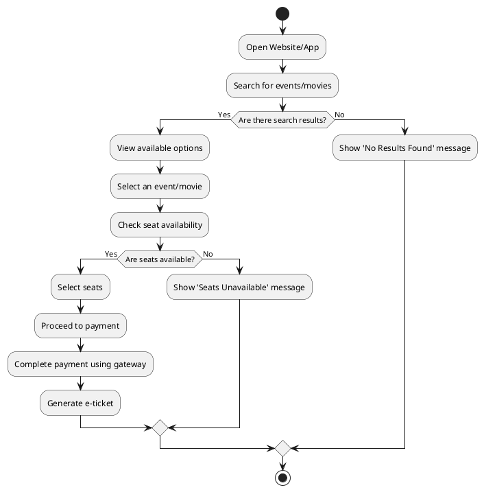
---
#### **3.2.2 Event Organizer Adding an Event**  
This diagram represents the workflow for event organizers to add a new event. It includes steps like providing event details, uploading media assets, setting ticket types and prices, and publishing the event for user visibility.  

**UML Diagram:**  

---
### PlantUML Code

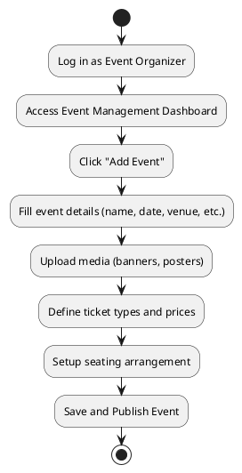
---
#### **3.2.3 Payment Process**  
This diagram outlines the payment process flow. It highlights the steps users follow to complete the payment, along with handling both successful and failed payment scenarios.  

**UML Diagram:**  

---

<!--  -->
### PlantUML Code

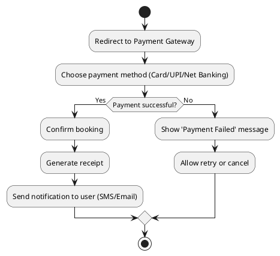

---

### **3.2.4 Registration Process**

This diagram illustrates the registration process for new users. It includes steps like account creation, email verification, and setting up user preferences. The diagram also covers scenarios where the email is already registered or the verification link is expired.

**UML Diagram:**

---

### PlantUML Code
<!--  -->
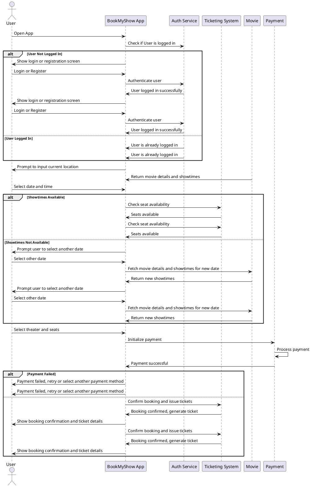

---
#### **3.2.5 Real-time Seat Booking Status Update**  
This diagram explains the real-time mechanism for seat availability updates. It depicts how a user queries seat status and how the backend processes and returns real-time updates.  

**UML Diagram:**  

---
### PlantUML Code

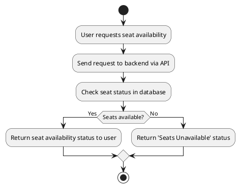
---
#### **3.2.6 Personalized Event Recommendations**  
This diagram showcases the process for generating personalized event recommendations. It demonstrates how user preferences and behavior are analyzed to suggest tailored events or movies.  

**UML Diagram:**  

---
### PlantUML Code

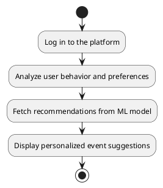
# **3.3 Abuse Case Diagram**
## **Actors**:
1. **Competitor Ticket Seller**:  
   - Affected by practices like forcing exclusive contracts, ticket availability manipulation, and predatory pricing.
2. **Independent Theater**:  
   - Pressured into exclusive contracts and unfair terms imposed by the platform.
3. **Consumer**:  
   - Impacted by excessive convenience fees, ticket manipulation, and predatory pricing.
4. **User**:  
   - Uses the platform to book cinema, show, or event tickets.
5. **Hacker**:  
   - Engages in malicious activities like creating fake accounts, performing unauthorized actions, and data theft.
6. **Admin**:  
   - Manages the system by monitoring logs and blocking abusive users.

## **Abuse Cases**:
- **Force Exclusive Contracts**: Imposing exclusivity on theaters.
- **Charge Excessive Convenience Fees**: Imposing high fees on consumers.
- **Manipulate Ticket Availability**: Controlling ticket visibility for profit.
- **Impose Unfair Terms on Small Theaters**: Imposing one-sided conditions on smaller entities.
- **Engage in Predatory Pricing**: Offering tickets at unsustainable prices to eliminate competition.
- **Book Cinema/Show/Event Tickets**: Primary legitimate functionality for users.
- **Create Fake Accounts**: Malicious activity by hackers to exploit the platform.
- **Perform Unauthorized Actions**: Actions by hackers to disrupt the system or exploit vulnerabilities.
- **Data Theft**: Malicious extraction of user data by hackers.
- **Monitor System Logs**: Admin activity to ensure the system's integrity.
- **Block Abusive Users**: Admin functionality to maintain a safe user environment.

## **Relationships**:
1. **Competitor**:  
   - Affected by unethical practices like exclusive contracts, ticket manipulation, and predatory pricing.
2. **Theater**:  
   - Pressured to comply with exclusive contracts and unfair terms.
3. **Consumer**:  
   - Faces negative impacts due to high fees, manipulated ticket availability, and predatory pricing.
4. **Admin**:  
   - Uses system logs to identify and block abusive users.
5. **Hacker**:  
   - Creates a chain of malicious activities:
     - Fake accounts → Unauthorized actions → Data theft.
6. **Dependencies Between Use Cases**:
   - Exclusive contracts enable ticket manipulation.
   - Ticket manipulation supports predatory pricing.
   - Unfair terms result in high fees.
   - Admin's log monitoring triggers the blocking of abusive users.

Below is the UML abuse case diagram for the BookMyShow platform:

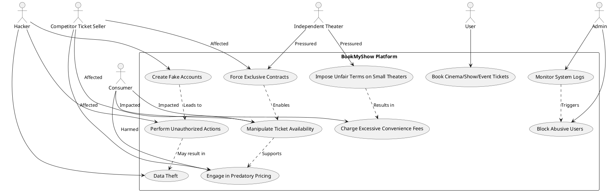

This diagram provides a comprehensive view of the platform's operational dynamics, highlighting legitimate use cases alongside unethical practices and their impacts on stakeholders.

# **3.4 Error Case Diagram**

## **Actors**:
1. **User**:  
   - Encounters issues like booking errors, payment failures, incorrect seat allocations, login failures, and invalid discount codes during their interaction with the platform.
2. **Theater Manager**:  
   - Notifies the system about show cancellations and encounters data synchronization issues.

## **Use Cases**:
- **Booking Error**: Errors encountered during the ticket booking process.
- **Payment Failure**: Failures during the payment transaction process.
- **Incorrect Seat Allocation**: Errors in the seating arrangement that affect the user's booking.
- **Show Cancellation**: Notifications triggered by show cancellations by theater managers.
- **Server Downtime**: System unavailability that affects user interactions, such as bookings or login attempts.
- **Data Sync Issues**: Problems in syncing data between the platform and users or theaters.
- **Account Login Failure**: Failed login attempts due to incorrect credentials or system issues.
- **Invalid Discount Code**: Errors when users enter an invalid or expired discount code.

## **Relationships**:
1. **User**:  
   - Encounters various issues like booking errors, payment failures, incorrect seat allocations, login failures, and invalid discount codes.
2. **Theater Manager**:  
   - Notifies the platform about show cancellations and experiences data synchronization issues.
3. **Dependencies Between Use Cases**:
   - **Booking Error** may result from **Payment Failure**.
   - **Booking Error** leads to **Incorrect Seat Allocation**.
   - **Server Downtime** causes **Booking Error** and **Login Failure**.
   - **Data Sync Issues** result in **Incorrect Seat Allocation**.

Below is the UML use case diagram for the BookMyShow platform:

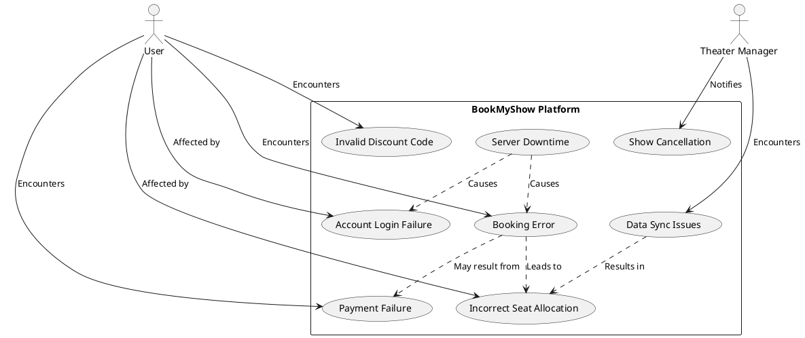
# **3.5 Use Case Diagram**

## **Actors**:
1. **User**:  
   - Searches for shows/events, books tickets, makes payments, cancels bookings, provides reviews, and applies discounts or offers.
2. **Theater Manager**:  
   - Manages theaters and shows, views sales reports.
3. **Admin**:  
   - Monitors system performance and resolves customer queries.

## **Use Cases**:
- **Search for Shows/Events**: Users search for available shows or events to book.
- **Book Tickets**: Users select and book tickets for shows or events.
- **Make Payment**: Users make payment for their bookings.
- **Cancel Booking**: Users can cancel their bookings.
- **Provide Reviews/Feedback**: Users can leave reviews or feedback on shows they attended.
- **Manage Theaters and Shows**: Managers control theater details and schedule shows.
- **View Sales Reports**: Managers can view sales reports related to theater performances.
- **Monitor System Performance**: Admin monitors the platform’s system performance for issues.
- **Apply Discounts or Offers**: Users apply available discounts or offers when booking tickets.
- **Resolve Customer Queries**: Admin resolves user queries or complaints related to the platform.

## **Relationships**:
1. **User**:  
   - Interacts with the system by searching for shows, booking tickets, making payments, canceling bookings, providing reviews, and applying discounts.
2. **Manager**:  
   - Manages theaters and shows, views sales reports.
3. **Admin**:  
   - Monitors system performance and resolves customer queries.
4. **Dependencies Between Use Cases**:
   - **Book Tickets** includes **Make Payment**.
   - **Cancel Booking** extends **Book Tickets** (since it is done after booking).
   - **Apply Discounts** is an optional step when **Book Tickets**.

Below is the UML use case diagram for the BookMyShow platform:

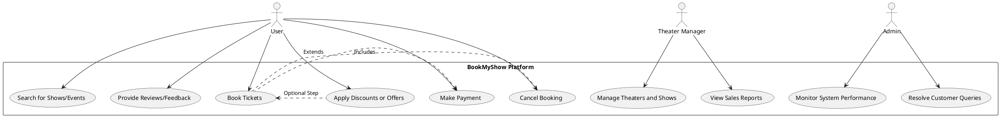

---

## 4. Module Design

### 4.1 Frontend Architecture

### PlantUML Code

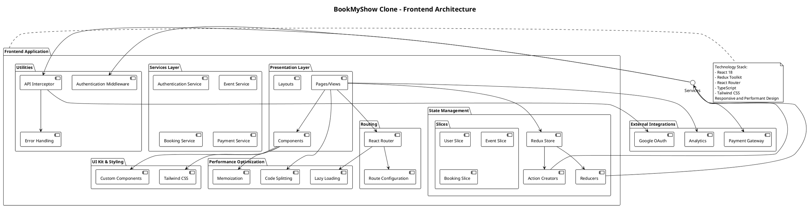
---
### 4.1.1 Architectural Overview
- **Modular Component-Based Design**: Utilizing React/Next.js for scalable frontend architecture  
- **Responsive Design**: Adaptive layout for web and mobile platforms  
- **State Management**: Implementing Redux/Context API for global state management  
- **Performance Optimization**: Code splitting, lazy loading, and efficient rendering .
--- 
### 4.1.2 User Interface Modules

#### 1. Authentication Module
- Login/Registration interfaces  
- Social media authentication  
- Password recovery workflows  
- Multi-factor authentication support  

#### 2. Content Discovery Module
- Personalized recommendation grid  
- Trending and categorized content sections  
- Advanced search and filtering mechanisms  
- Content carousel and horizontal scrolling views  

---
### 4.1.3 Client-Side Processing
- **Local Caching**: Implementing browser storage for performance  
- **Offline Support**: Service worker integration  
- **Real-time Updates**: WebSocket connections for live interactions  
- **Error Boundary Management**: Graceful error handling and user notifications  

---

## 4.2 Backend System Architecture

### PlantUML Code

```plantuml
@startuml
package "Backend System Architecture" {
    
    package "Microservices" {
        class EventService {
            + getEventDetails(eventId: int): Event
            + createEvent(event: Event): void
            + updateEvent(eventId: int, event: Event): void
        }

        class BookingService {
            + createBooking(userId: int, bookingDetails: Booking): BookingConfirmation
            + cancelBooking(bookingId: int): void
            + getBookingDetails(bookingId: int): Booking
        }

        class PaymentService {
            + processPayment(paymentDetails: Payment): PaymentResponse
            + getPaymentStatus(paymentId: int): PaymentStatus
        }

        class NotificationService {
            + sendNotification(userId: int, message: String): void
            + scheduleNotification(eventId: int, reminderTime: Date): void
        }

        class RecommendationService {
            + generateRecommendations(userId: int): List<Event>
            + updateRecommendationModel(userActivity: UserActivity): void
        }

        class AuthenticationService {
            + login(credentials: Credentials): AuthToken
            + register(userDetails: User): User
            + validateToken(token: String): boolean
        }
    }

    package "Communication Mechanism" {
        class RESTAPI {
            + exposeEndpoints(): void
        }

        class MessageBroker {
            + publish(event: Event): void
            + subscribe(topic: String): void
        }
    }
    
    RESTAPI --> EventService
    RESTAPI --> BookingService
    RESTAPI --> PaymentService
    RESTAPI --> NotificationService
    RESTAPI --> RecommendationService
    RESTAPI --> AuthenticationService

    MessageBroker --> EventService
    MessageBroker --> BookingService
    MessageBroker --> NotificationService
    MessageBroker --> RecommendationService
}
@enduml

```
# BookMyShow Clone System Design

---

## 4.2.1 Distributed Service Ecosystem
- **Microservices Architecture**: Independently scalable services for ticket booking, event management, and user interactions.  
- **Event-Driven Communication**: Kafka/RabbitMQ for real-time updates like seat availability and booking confirmations.  
- **Service Discovery**: Consul/Kubernetes for dynamic service registration to ensure seamless scalability.  

---

## 4.2.2 Authentication and Security Layer

### 1. Identity Management
- JWT-based authentication for secure user sessions.  
- Role-based access control for users, organizers, and administrators.  
- OAuth 2.0 support for third-party logins via Google or Facebook.  
- Multi-factor authentication for added security.  

### 2. Security Mechanisms
- Encrypted token storage for authentication and session management.  
- Brute-force protection against unauthorized access attempts.  
- Cross-Site Scripting (XSS) and SQL injection safeguards for user input.  
- Data validation and sanitization to prevent malicious activities.  

---

## 4.2.3 Content Management Services

### 1. Event Processing Service
- Event metadata management, including name, date, venue, and ticket pricing.  
- High-quality poster generation and media optimization for event promotion.  
- Real-time updates on ticket availability and seat assignments.  
- Content moderation for user reviews and feedback.  

### 2. Storage Management
- Distributed file storage (e.g., AWS S3 or Google Cloud Storage) for event posters, banners, and promotional content.  
- CDN integration for fast and efficient delivery of event media across regions.  
- Backup and disaster recovery mechanisms for all event and booking data.  

---

## 4.2.4 Recommendation and Discovery Engine

### 1. Machine Learning Models
- Collaborative filtering to suggest events based on user preferences.  
- Content-based recommendation for local events, trending shows, and upcoming releases.  
- Hybrid recommendation models combining user interactions and event popularity.  
- Analysis of user browsing and booking behavior for personalized event suggestions.  

### 2. Personalization Mechanisms
- Real-time tracking of user preferences for event recommendations.  
- Contextual recommendations based on location, time, and seasonality.  
- A/B testing of recommendation strategies to optimize user engagement.  
- Ensuring diversity in suggestions to introduce users to new categories.  

---

## 4.2.5 Interaction and Engagement Services

### 1. User Interaction Tracking
- Real-time feedback mechanisms like reviews, ratings, and comments.  
- Notification dispatch system for event updates, cancellations, and offers.  
- Collection of engagement metrics such as clicks, shares, and bookings.  
- Workflow integration for community interactions like Q&A or live polls during events.  

### 2. Social Features
- Follow/subscribe functionality for organizers and event categories.  
- User-generated event lists for shared planning and recommendations.  
- Community content curation based on likes, ratings, and shares.  
- Collaborative experiences such as group bookings and live discussions.  

---

## 4.3 Cross-Cutting Concerns

### 4.3.1 Observability and Monitoring
- Distributed tracing for monitoring inter-service communications.  
- Real-time performance metrics collection for event management and bookings.  
- Centralized log aggregation to monitor and debug issues.  
- Alerting systems for downtime or failed booking processes.  

### 4.3.2 Scalability Strategies
- Horizontal scaling of microservices for high traffic events and ticket sales.  
- Load balancing across server clusters for optimal performance.  
- Caching mechanisms (e.g., Redis) for frequently accessed data like seat availability.  
- Auto-scaling configuration to handle traffic spikes during peak hours.  

### 4.3.3 Compliance and Privacy
- GDPR compliance for secure handling of user data.  
- Data anonymization to protect user identity in analytics.  
- User consent management for notifications and promotional content.  
- Transparent data handling policies for organizers and users.  

---

## 4.4 Advertising Ecosystem

### 4.4.1 Ad Targeting Strategy
- Demographic-based targeting for event promotions (e.g., age, location).  
- Interest and behavior profiling for personalized ads (e.g., music concerts vs. comedy shows).  
- Geographic targeting for local events and shows.  
- Device-specific ad delivery for mobile and desktop platforms.  

### 4.4.2 Ad Placement Types

#### 1. Banner Ad Formats
- Event banners displayed on the homepage or category pages.  
- Mid-scroll ads for event categories and search results.  
- Sponsored banners for premium event listings.  

#### 2. Additional Placement Channels
- Sidebar recommendations for trending events.  
- Footer ads for promotional offers and discounts.  
- Sponsored sections for featured organizers.  

### 4.4.3 Revenue Generation
- Impression-based pricing (CPM) for banner ads.  
- Performance-based pricing (CPC) for ad clicks.  
- Revenue sharing with event organizers for paid promotions.  
- Conversion tracking to measure ad performance.  

### 4.4.4 Compliance and User Experience
- User ad preference settings to control ad visibility.  
- Opt-out mechanisms for personalized advertisements.  
- Frequency capping to avoid overexposure to the same ad.  
- Content moderation to ensure ads align with platform policies.  

### 4.4.5 Technical Infrastructure
- Low-latency ad delivery for seamless integration.  
- Real-time bidding support for premium ad placements.  
- Fraud detection mechanisms for invalid clicks and impressions.  
- Compatibility with cross-platform ad formats.  

### 4.4.6 Advertiser Tools
- Self-service ad management portal for organizers.  
- Campaign tracking and performance analytics.  
- A/B testing capabilities for ad creatives.  
- Detailed reports for ad revenue and engagement metrics.
---
## 5. Database Design

## Database Design for BookMyShow Clone

The BookMyShow clone uses a combination of SQL and NoSQL databases. Below is the schema for major entities:

- **Users**: Stores user information like username, email, and preferences.  
- **Events**: Stores event details, such as name, date, venue, and ticket availability.  
- **Bookings**: Stores booking information, including seat selection and payment status.  
- **Comments**: Stores user comments and feedback for events and movies.  
- **Interactions**: Tracks likes, views, and shares related to events and movies.  
- **Subscriptions**: Tracks user subscriptions to events or premium features.  

---

### PlantUML Code

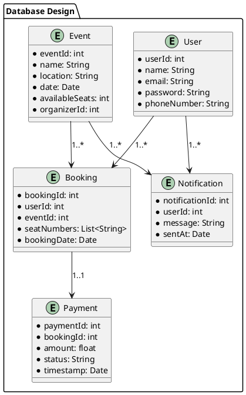
---
## 6. Interface Design

### PlantUML Code

```plantuml
@startuml
skinparam linetype polyline
title BookMyShow - Interface Design

rectangle "Authentication Screens" {
    (Login Screen) as Login
    (Registration Screen) as Register
    (Password Reset) as PasswordReset
}

rectangle "Main Application Screens" {
    (Home/Feed Screen) as Home
    (Event Details Screen) as EventDetails
    (Search Results) as Search
    (Booking Screen) as Booking
    (Payment Screen) as Payment
    (Trending Screen) as Trending
    (Subscriptions Screen) as Subscriptions
}

rectangle "Event Organizer Screens" {
    (Event Creation) as EventCreate
    (Event Management) as EventManage
    (Event Customization) as EventCustom
    (Analytics Dashboard) as Analytics
    (Monetization) as Monetization
}

rectangle "User Profile Screens" {
    (User Profile) as Profile
    (Booking History) as History
    (Subscription Plans) as Subscriptions
}

rectangle "Navigation Components" {
    (Sidebar) as Sidebar
    (Top Navigation Bar) as TopNav
    (Search Bar) as SearchBar
    (Mobile Navigation) as MobileNav
}

rectangle "UI Components" {
    (Event Thumbnail) as Thumbnail
    (Follow Button) as FollowButton
    (Interaction Controls) as InteractControls
    (Comment Section) as Comments
    (Recommended Events) as Recommendations
}

' Navigation Flows
Login --> Home
Register --> Home
Home --> EventDetails
EventDetails --> Booking
SearchBar --> Search
Sidebar --> Home
Sidebar --> Subscriptions
Sidebar --> Trending
EventCreate --> EventManage
EventCreate --> EventCustom

note right of "UI Components"
    Design Principles:
    - Responsive Design
    - Mobile-First Approach
    - Consistent UI/UX
    - Accessibility
    - Performance Optimized

    Breakpoints:
    - Mobile: <600px
    - Tablet: 600-1024px
    - Desktop: >1024px
end note
@enduml
```
---
## 6.2 External System Interfaces
- **CDN**: Delivers event media (posters, trailers) to users efficiently.  
- **Analytics Tools**: Tracks user interactions with events and performance metrics.  
- **Search Engine**: Provides fast and accurate event search results.  

---

## 6.3 Notification Flow Diagram
This diagram represents the flow of notifications for events like new comments or event updates.

### PlantUML Code

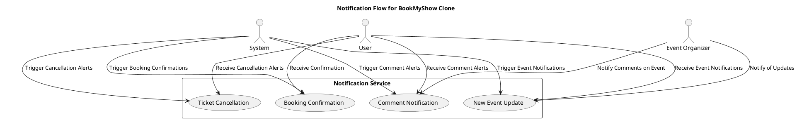
---

## 7. Non-Functional Requirements

### 7.1 Performance
- **Support for 100,000 simultaneous users** with peak load handling.
- Maximum **ticket booking time**: 2 seconds for fast ticket processing.
- **Real-time seat availability** updates with a response time under 1 second.
- **Content delivery network (CDN)** response time under 50 milliseconds for quick loading of event images and media.
- Efficient resource utilization with **less than 70% CPU** and memory load during peak traffic.
- Support for **4K resolution streaming** for virtual events, if applicable.

---

### 7.2 Scalability
- **Horizontal scaling** capabilities for all backend services to handle large spikes in traffic.
- **Microservices architecture** enabling independent scaling of each service (e.g., ticketing, user management, event discovery).
- **Automatic horizontal scaling** based on real-time traffic metrics.
- **Multi-region deployment** for high availability and low latency.
- **Containerization** using **Docker** and **Kubernetes** for seamless scaling.
- **Load balancing** across multiple server instances to ensure even distribution of traffic.
- **Elastic database scaling** with **read replicas** and **sharding mechanisms** for scalable data storage.

---

### 7.3 Availability
- **99.9% system uptime guarantee**, ensuring the platform is always accessible for users.
- **Redundant component architecture** to eliminate single points of failure.
- **Multi-region failover support** for uninterrupted access in case of regional outages.
- **Automatic service recovery mechanisms** to handle and restore failed services quickly.
- **Zero-downtime deployments** to ensure uninterrupted service during software updates.
- **Real-time health monitoring** and automatic service restoration to maintain system stability.
- **Geographically distributed data centers** for continuous operation and low-latency access.

---

### 7.4 Security
- **End-to-end encryption** for all sensitive data.
- **Multi-factor authentication** for users.
- **Role-based access control (RBAC)** for secure role assignment.
- Comprehensive **input validation** and sanitization to prevent malicious input.
- Protection against common web vulnerabilities:
  - SQL injection
  - Cross-site scripting (XSS)
  - Cross-site request forgery (CSRF)
- Regular **security audits** and **penetration testing** to identify potential risks.
- **Compliance with international data protection regulations** (e.g., GDPR, CCPA).
- Secure **API design** with **token-based authentication**.
- **Advanced threat detection** and prevention mechanisms.

---

### 7.5 Reliability
- **Automatic error detection** and logging for proactive issue resolution.
- **Graceful error handling** to ensure smooth user experience even during failures.
- **Circuit breaker pattern** to prevent cascading failures.
- Comprehensive **monitoring** and **alerting systems** to detect and respond to issues in real-time.
- Detailed **performance and error reporting** to track and resolve issues.
- **Automatic rollback** of problematic deployments to ensure minimal service disruption.

---

### 7.6 Compliance
- **GDPR compliance** for user data protection.
- **CCPA data privacy regulations** for California-based users.
- **COPPA guidelines** for content involving minors.
- **Accessibility standards** (WCAG 2.1) for users with disabilities.
- **Transparent data usage policies** to inform users about data handling.
- **User consent management** for data collection and processing.
- **Right to be forgotten** implementation for user data deletion requests.

---

## 8. Conclusion
This comprehensive **Software Design Description** provides a thorough blueprint for a robust, scalable, and user-centric ticket booking platform. By leveraging modern architectural principles, microservices design, and advanced technologies, the **BookMyShow Clone** is engineered to:

- Handle massive concurrent user loads during peak traffic times.
- Provide seamless and responsive user experiences across web and mobile platforms.
- Ensure **high availability** and **performance** for uninterrupted access to events.
- Maintain stringent **security** and **privacy** standards for user data.
- Support future technological innovations such as **real-time streaming**, **personalized recommendations**, and **dynamic pricing**.

The modular design allows for independent scaling of components, while strategic integration with external services enables efficient content delivery, user engagement, and analytics. The platform is not just a clone but a sophisticated, adaptable solution capable of competing in the dynamic entertainment and ticket booking market.

### Key Differentiators include:
- Flexible **microservices architecture** for scalable operations.
- Advanced **machine learning** for personalized event recommendations and dynamic pricing.
- **Robust security** and compliance frameworks.
- **Scalable infrastructure** for handling high user traffic.
- **Real-time interaction capabilities** for live events and notifications.

Continuous improvement, regular **performance optimizations**, and staying aligned with emerging technologies will be critical to the platform's long-term success and user satisfaction.

