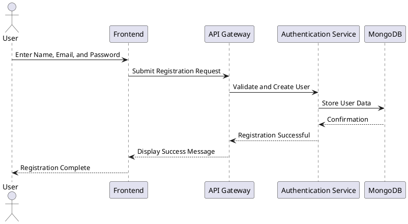
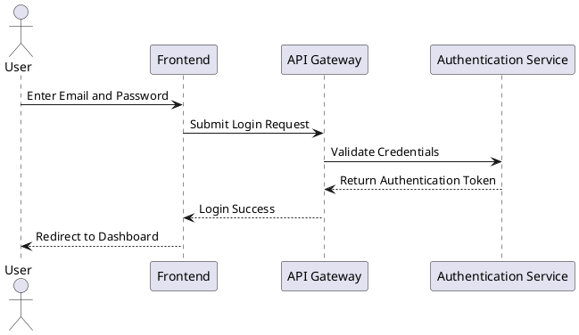
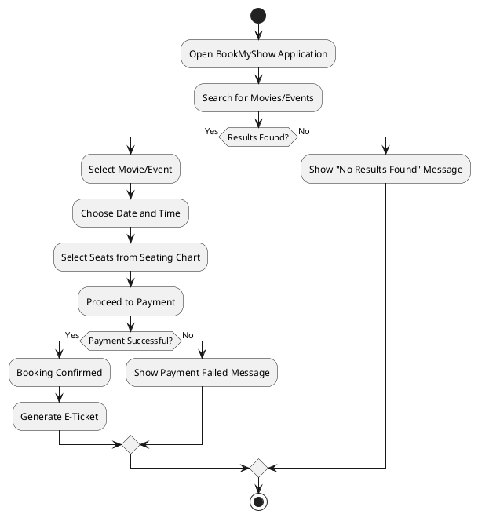
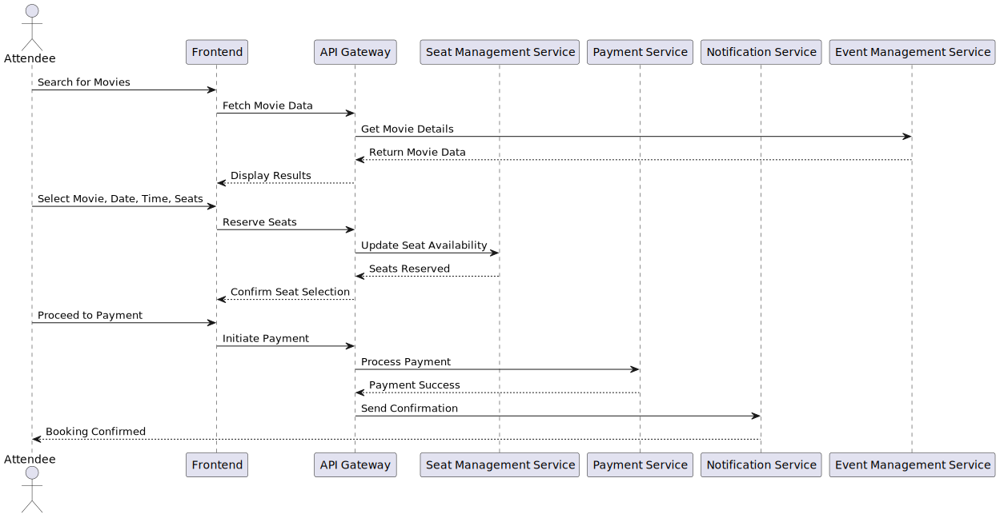
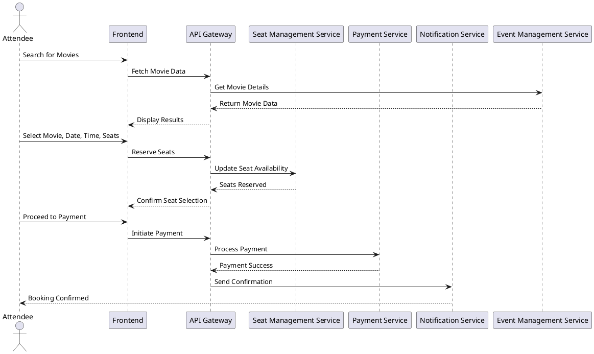

# Software Design Description (SDD) for BookMyShow Competitor

## 1. Introduction

### 1.1 Purpose

This document provides a comprehensive software design description for the BookMyShow application, outlining its architecture and design to guide development and ensure all stakeholder requirements are met.

### 1.2 Scope

The SDD covers the design aspects of the BookMyShow application, including system architecture, component interactions, data management, and user interfaces. The application is built using a microservices architecture, with each service focused on specific functionalities.

### 1.3 Overview

BookMyShow facilitates movie and event ticket bookings by integrating with multiple theater chains, providing real-time seat availability, and supporting various payment methods. The system is designed to handle high user concurrency and ensure data consistency.

### 1.4 References

- IEEE Std 1016-2009: IEEE Standard for Information Technology—Systems Design—Software Design Descriptions.
- [Design BookMyShow – A System Design Interview Question](https://www.geeksforgeeks.org/design-bookmyshow-a-system-design-interview-question/)
- [Design a movie ticket booking system like BookMyShow](https://www.geeksforgeeks.org/design-movie-ticket-booking-system-like-bookmyshow/)

### 1.5 Definitions and Acronyms

- **SDD**: Software Design Description
- **API**: Application Programming Interface
- **UML**: Unified Modeling Language

---

## 2. System Overview

The BookMyShow system employs a microservices-based architecture. Each service is designed for scalability, fault tolerance, and efficient processing.

---

## 3. System Architecture

### 3.1 Architectural Design

The system comprises the following components:

- **Mobile Frontend (Flutter)**: Enables user interaction on mobile devices.
- **Web Frontend (React)**: Provides a responsive user interface for web users.
- **Backend Services**: API Gateway routes requests to microservices, ensuring modularity.

### 3.2 Microservices

- **Authentication Service**: Handles user login, signup, and session management.
- **Event Management Service**: Manages events, movies, showtimes, and venues.
- **Seat Management Service**: Updates and tracks seat availability.
- **Payment Service**: Processes payments securely.
- **Notification Service**: Sends booking confirmations and promotional notifications.

---

## 4. Data Design

### 4.1 MongoDB Schema (Authentication Service)

```json
{
  "_id": ObjectId,
  "name": String,
  "email": String,
  "password_hash": String,
  "phone_number": String,
  "preferences": {
    "genres": [String],
    "languages": [String],
    "notifications": Boolean
  },
  "created_at": Date,
  "last_login": Date
}
```

### 4.2 MySQL Schemas

#### **Movies Table (Event Management Service)**

```sql
CREATE TABLE Movies (
    movie_id INT AUTO_INCREMENT PRIMARY KEY,
    title VARCHAR(255) NOT NULL,
    genre VARCHAR(100),
    language VARCHAR(50),
    release_date DATE,
    duration INT,
    created_at TIMESTAMP DEFAULT CURRENT_TIMESTAMP
);
```

#### **Venues Table (Event Management Service)**

```sql
CREATE TABLE Venues (
    venue_id INT AUTO_INCREMENT PRIMARY KEY,
    name VARCHAR(255) NOT NULL,
    location VARCHAR(255),
    total_screens INT,
    created_at TIMESTAMP DEFAULT CURRENT_TIMESTAMP
);
```

#### **Shows Table (Event Management Service)**

```sql
CREATE TABLE Shows (
    show_id INT AUTO_INCREMENT PRIMARY KEY,
    movie_id INT NOT NULL,
    venue_id INT NOT NULL,
    show_date DATE NOT NULL,
    start_time TIME NOT NULL,
    end_time TIME NOT NULL,
    screen_number INT,
    available_seats INT,
    price DECIMAL(10, 2),
    pricing_tier ENUM('VIP', 'Premium', 'General') NOT NULL,
    seating_chart JSON,
    created_at TIMESTAMP DEFAULT CURRENT_TIMESTAMP,
    FOREIGN KEY (movie_id) REFERENCES Movies(movie_id),
    FOREIGN KEY (venue_id) REFERENCES Venues(venue_id)
);
```

#### **Bookings Table (Seat Management Service)**

```sql
CREATE TABLE Bookings (
    booking_id INT AUTO_INCREMENT PRIMARY KEY,
    show_id INT NOT NULL,
    user_id VARCHAR(24) NOT NULL,
    booking_date TIMESTAMP DEFAULT CURRENT_TIMESTAMP,
    seats_booked JSON,
    add_ons JSON,
    total_amount DECIMAL(10, 2),
    payment_status ENUM('Pending', 'Completed', 'Failed') DEFAULT 'Pending',
    booking_status ENUM('Active', 'Cancelled') DEFAULT 'Active',
    FOREIGN KEY (show_id) REFERENCES Shows(show_id)
);
```
*add-ons include parking-passes, food vouchers and merchandise.
### 4.3 RabbitMQ Queue (Notification Service)

- **Queue Name**: `notification_queue`
- **Message Format**:

```json
{
  "user_id": "ObjectId",
  "message": "Your booking is confirmed!",
  "type": "EMAIL|SMS",
  "timestamp": "2024-12-12T15:30:00Z"
}
```

---

## 5. Component Design

### 5.1 Authentication Service

- **Responsibilities**: User registration, authentication, profile management.
- **Database**: MongoDB.

### 5.2 Event Management Service

- **Responsibilities**: Managing movies, venues, and showtimes.
- **Database**: MySQL.

### 5.3 Seat Management Service

- **Responsibilities**: Tracking and updating seat availability.
- **Database**: MySQL.

### 5.4 Payment Service

- **Responsibilities**: Handling payment transactions and refunds.
- **External Dependencies**: Payment Gateway.

### 5.5 Notification Service

- **Responsibilities**: Sending user notifications via RabbitMQ.

---
## 6. Activity and Sequence Diagrams

### 6.1 Sequence Diagram: User Registration Process



### 6.2 Sequence Diagram: Login Authentication Process




### 6.3 Activity Diagram: Attendee Booking Workflow




### 6.4 Sequence Diagram: Attendee Booking Process






## 7. Human Interface Design

### 7.1 User Interface Modules

- **Search Module**: Allows users to find movies and events.
- **Booking Module**: Provides seat selection and ticket confirmation.
- **Profile Module**: Displays user information and booking history.

### 7.2 External Services Integration

- **Email/SMS Service**: For sending notifications.
- **Payment Gateway**: For secure transaction processing.

---

## 8. Requirements Traceability Matrix

| Requirement ID | Description                          | Design Component(s)      |
| -------------- | ------------------------------------ | ------------------------ |
| FR-4.1           | User Registration and Authentication | Authentication Service   |
| FR-4.4           | Movie and Event Listings             | Event Management Service |
| FR-4.2           | Seat Booking and Updates             | Seat Management Service  |
| FR-4.3           | Payment Processing                   | Payment Service          |
| FR-3.3        | Notifications                        | Notification Service     |

---

## 9. Appendices

### Appendix A: Glossary

- **MongoDB**: NoSQL database for flexible, document-oriented storage.
- **MySQL**: Relational database for structured data.
- **RabbitMQ**: Message broker for asynchronous communication.

### Appendix B: References

- IEEE Std 1016-2009: IEEE Standard for Information Technology—Systems Design—Software Design Descriptions.
- [Design BookMyShow – A System Design Interview Question](https://www.geeksforgeeks.org/design-bookmyshow-a-system-design-interview-question/)
- [Design a movie ticket booking system like BookMyShow](https://www.geeksforgeeks.org/design-movie-ticket-booking-system-like-bookmyshow/)

---

